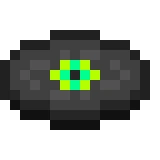

# Music Disc

### still in development  


### Dependencies Modules

**node.js  `v16.13.2`**  
**discord-player  `^5.2.0`**  
**discord.js  `^13.6.0`**  
**dotenv  `^16.0.0`**  
**ffmpeg-static  `^4.4.0`**  
**express  `^4.17.2`**  
**opusscript  `^0.0.8`**  
**ms  `^3.0.0-canary.1`**  


## Deploying with node.js

### Clone the repository
```
git clone https://github.com/hmes98318/Music_Disc.git
```

### Install the dependencies
auto install all dependencies on [`package.json`](./package.json)  
```
npm install
```

### configure [`.env`](./.env) file
```env
TOKEN = "your_token"
```

## Running the script 
```
node index.js
```


## Deploying with Docker  
**image link** : https://hub.docker.com/r/hmes98318/music-disc  
### put your Token into [`docker-compose.yml`](./docker-compose.yml)
```yml
version: '3.8'
services:
  music-disc:
    image: hmes98318/music-disc:1.0.0
    environment:
      TOKEN: "your_token"
```

### Start the container  
```
docker-compose up -d
```
