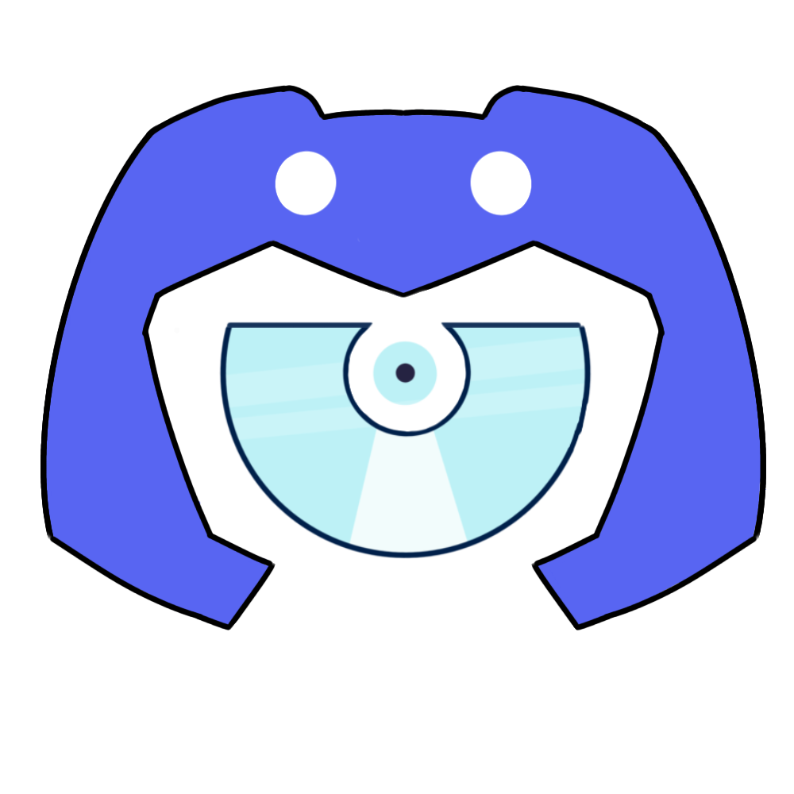

# Music Disc 
### The branch has been moved to https://github.com/hmes98318/Music-Disc-discord-player

<a href="https://github.com/hmes98318/Music-Disc/releases"></a> 
<a href="https://discord.js.org/"></a> 
<a href="https://nodejs.org/">=16.13.0-brightgreen?style=for-the-badge&logo=Node.js"></a> 
<a href="https://github.com/hmes98318/Music-Disc/blob/main/LICENSE"></a>  

### Discord.js v14 Music Bot  
Supports **YouTube**, **Spotify**, **SoundCloud** streams.


### Reference version  
[**node.js  `v18.16.0`**](https://nodejs.org/en/)  
[**discord.js  `v14.11.0`**](https://www.npmjs.com/package/discord.js)  


## Deploying with node.js

### Clone the latest version of the repository
```
git clone -b v1.4.2 https://github.com/hmes98318/Music-Disc.git
```
or [**click here**](https://github.com/hmes98318/Music-Disc/releases) to download  


### Install the dependencies
install all the dependencies from [`package.json`](./package.json)  
```
npm install
```

### Configure environment
[`.env`](./.env) 
```env
TOKEN = "your_token"
NAME = "Music Disc"
PREFIX = "+"
PLAYING = "+help | music"
EMBEDS_COLOR = "#FFFFFF"
DEFAULT_VOLUME = 50
MAX_VOLUME = 100
AUTO_LEAVE = true
AUTO_LEAVE_COOLDOWN = 5000
DISPLAY_VOICE_STATE = true
PORT = 33333

TEXT_QUERY_TYPE = "youtubeSearch"
URL_QUERY_TYPE = "auto"
DP_FORCE_YTDL_MOD = "play-dl"
```

<details> 
  <summary>Detailed description</summary>

  **`AUTO_LEAVE`** : After the music finished, can choose whether let the bot leave voice channel automatically or not.  
  **`AUTO_LEAVE_COOLDOWN`** : Timer for auto disconnect(ms).  
  **`DISPLAY_VOICE_STATE`** : Show voice channel status updates.   
  </br>
  
  **`TEXT_QUERY_TYPE`** : The default search engine for text search.  
  The following are the available options for **TEXT_QUERY_TYPE**:
    <pre>
      autoSearch, youtubeSearch, spotifySearch, soundcloudSearch, appleMusicSearch
    </pre>

  **`URL_QUERY_TYPE`** : The default search engine for links.  
  The following are the available options for **URL_QUERY_TYPE**:
    <pre>
      auto, youtube, spotifySong soundcloud, appleMusicSong
    </pre>

  **`DP_FORCE_YTDL_MOD`** : Streaming extractor settings. The default streaming library used is **play-dl**.  
  If you want to use another library, you can install one of the following libraries and change the `DP_FORCE_YTDL_MOD` setting.  
    <pre>
      $ npm install ytdl-core
      $ npm install @distube/ytdl-core
    </pre>
</details>


## Running the script 
```
npm run start
```


## Deploying with Docker Compose  
**image link** : https://hub.docker.com/r/hmes98318/music-disc  
### put your Token into [`docker-compose.yml`](./docker-compose.yml)
```yml
version: '3.8'
services:
  music-disc:
    image: hmes98318/music-disc:1.4.2
    container_name: music-disc
    restart: always
    ports:
      - 33333:33333
    environment:
      TOKEN: "your_token"
      PREFIX: "+"
      PLAYING: "+help | music"
      EMBEDS_COLOR: "#FFFFFF"
      DEFAULT_VOLUME: 50
      MAX_VOLUME: 100
      AUTO_LEAVE: "true"
      AUTO_LEAVE_COOLDOWN: 5000
      DISPLAY_VOICE_STATE: "true"
      TEXT_QUERY_TYPE: "youtubeSearch"
      URL_QUERY_TYPE: "auto"
      DP_FORCE_YTDL_MOD: "play-dl"
```

### Start the container  
```
docker-compose up -d
```


## Deploying with Replit  
Watch it by clicking on the image down below  
[](https://youtu.be/WH5aSHIebcc)  


